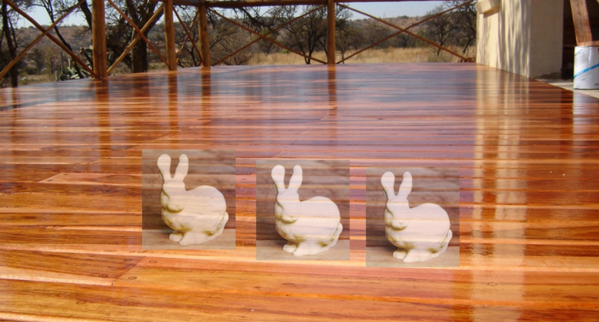

## Abstract

_The Hololens has the capabilities to produce good quality 3D scans of indoor scenes, but spending time scanning a room can be a tedious process. In order to view objects, perform tasks, or even play games, Hololens users spend a lot of time looking around and exploring their environments, so why not design applications that encourage this exploration to occur in regions which need to be scanned?_

_We propose creating a game which, as a result of its mechanics, causes the players to unknowingly produce an accurate and complete scan of their surroundings._

## The Gameplay

Currently, we are considering a number of gameplay options. Our goal is to produce a convincing and entertaining experience that successfully obfuscates the ulterior motive of scanning the room. The following is a simple example of possible gameplay, although many alternatives based around the idea of hidden spatial objectives are possible.

### Draft: Hide and Seek

The game state begins with the players standing in a room. As the application launches, a number of bunnies appear in the room, but quickly scurry away. 

The goal is to find the bunnies before the other players. Players will search the explorable space for the bunnies. Spatial sound cues will be given to lead players in their direction. Once found, bunnies will scurry away to other parts of the scene until some criteria is met.

Behind the scenes, the placement of bunnies is selected based on regions of the room which require additional scanning. By placing bunnies near regions that need to be scanned, players will be encouraged to move their gaze through that region, providing additional observations to refine the 3D model

## The Scanning

The primary objective in this application is producing a high-quality 3D mesh which accurately models the scene around the players. Although most existing Hololens applications already involve a scanning step, non-expert scanners usually produce incomplete and low quality scans.

In order to encourage users to provide useful scanning data, it is first necessary to identify regions that need to be scanned. These can be regions that haven't yet been scanned by any of the players, or even regions with inconsistent models across multiple Hololens devices. Once they have been identified, the gameplay will cue users to move towards the regions to provide additional observations.

A missing region:

A region with inconsistent models across Hololens devices:

## Technical Challenges

### Multiplayer

**Mesh Alignment**:
Alignment of the global model across multiple devices may prove to be a challenge if there are few overlapping regions or the individual models are noisy and inconsistent. It may be necessary to provide some user input to generate an initial rough alignment. We can also use the large-scale room structure (e.g. Manhattan-world walls, floor, and ceiling) to help alignment.

**Model Consistency**:
It's important that throughout the game, players all experience the same 3D scene. This involves not only aligning multiple models, but merging the observations into a globally optimal model that is consistent with the input data from each player's Hololens. This might involve a more intelligently simplified mesh (e.g. replacing large planar structures) for network data efficiency. Having identical meshes will allow players to have consistent occlusions, a very important factor in a game where objects are hidden behind parts of the real-world geometry.

### Mesh Region Scoring

In order to decide whether a region needs to be scanned, it's necessary to determine the quality of that region's current scan. A region should be scanned if individual models are inconsistent and the alignment error is high, or if the region has no data whatsoever. There exists at least one edge case, however.

**Scene Complexity and Unscannable Regions**:
There exist cases in which a region cannot be scanned, or is too complex to be scanned accurately. A mirror, for example, may be seen hundreds of times from different perspectives, but may never produce a consistent model of its true geometry. Therefore, it may be necessary to identify the number of observations that have been given for a particular region and if a consistent model has not been generated, either forego reconstruction of that region or produce an estimate given its surroundings.

### Termination Criteria
Deciding whether a mesh is "good enough" is non-trivial. This will involve deciding on some quality metric for the mesh in its entirety. 

### Object Placement
If we decide to implement any variant of the hide-and-seek game above, we will be often be placing objects near parts of the mesh that are incomplete. This may prove to be a problem, considering that missing parts of the model may occupy large portions of the free space in which we might consider placing the hidden object. Some analysis must be done to avoid placing our hidden objects within real-world geometry. 

## Questions and Concerns
Will there be portions of the mesh corresponding to the other players in the room even if those players are moving?

Can we get any more low-level data from the Hololens? SDF, depth map? Can we ensure that the data we're receiving is not biased by previous observations?

How well can we approximate the mesh with primitives and still have a compelling experience?

